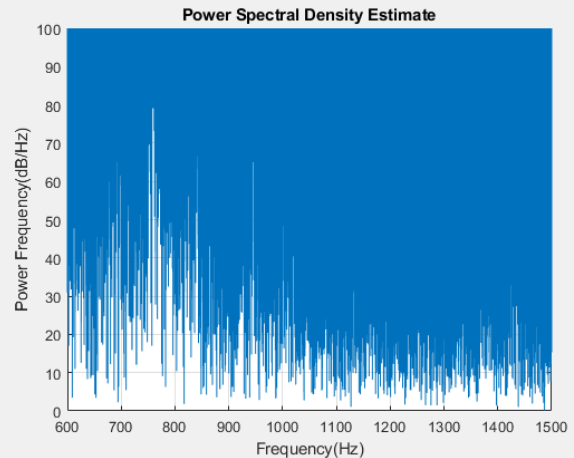
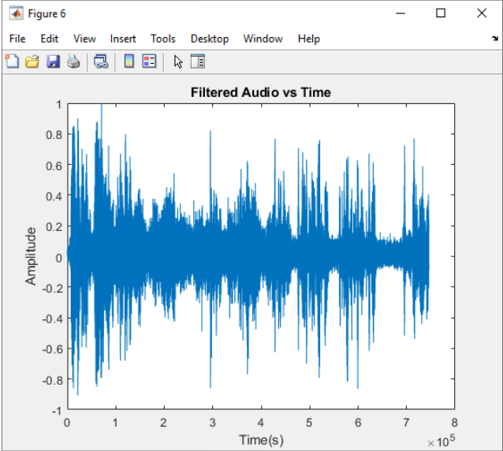

# 🌀 Butterworth Lowpass Filter for Audio Noise Reduction

## 📌 Project Overview
The **Butterworth Lowpass Filter for Audio Noise Reduction** project involves the design and implementation of a **Butterworth lowpass filter** in **MATLAB** to remove unwanted noise from an audio signal. The project aims to reduce background noise, such as thunder and high-frequency tones, from an audio sample while retaining the desired low-frequency signals.

This project includes:
- **Audio frequency analysis** using DFT and spectrogram techniques
- **Butterworth filter design** and application
- **Visualization** of results using DFT, spectrogram, and time-domain plots

  

---

## 🎯 Project Requirements
This project involves the following key components and functionality:

- **Audio Input**: An audio file (`input_audio.wav`) that contains a conversation with noise.
- **Filter Design**: Implementation of a **Butterworth lowpass filter** to attenuate high-frequency noise while passing low-frequency signals.
- **Analysis Tools**: Use of **Discrete Fourier Transform (DFT)**, **Spectrogram**, and **Time-Domain plots** to visualize the effects of the filter.
- **MATLAB Environment**: Designed and implemented using **MATLAB** with Signal Processing Toolbox for filter design.

### 🔍 **Key Objectives:**
- Design and implement a **Butterworth lowpass filter** in MATLAB
- **Analyze** the audio signal to determine the frequency components
- **Apply** the filter to reduce high-frequency noise
- **Visualize** the results using DFT, Spectrogram, and Time-Domain plots

---

## ⚙️ System Design

### 🔹 **Audio Frequency Analysis**
The audio sample consists of a conversation with noise, including thunder and high-frequency tones. The audio signal is first analyzed using two techniques:
- **Discrete Fourier Transform (DFT)**: Used to identify the frequency components of the audio signal.
- **Spectrogram**: Provides a visual representation of the signal's frequency content over time.

### 🔹 **Butterworth Filter Design**
A **Butterworth lowpass filter** is used to remove high-frequency noise while maintaining the desired low-frequency signals. The filter is designed with the following specifications:
- **Filter Order**: Chosen based on the desired cut-off frequency and noise characteristics.
- **Cut-off Frequency**: Selected to isolate speech frequencies and attenuate the noise.

### 🔹 **Filter Implementation**
The audio signal is processed through the Butterworth filter in MATLAB. Key steps include:

1. **Before Filtering (DFT)**: The frequency components of the noisy signal are analyzed to visualize the unwanted high-frequency noise.
2. **After Filtering (DFT)**: The filtered signal is analyzed to verify that high-frequency noise has been effectively reduced.
3. **Magnitude Response**: The frequency response of the designed Butterworth filter is plotted to illustrate its attenuation of high frequencies.
4. **Time-Domain Analysis**: The final filtered signal is plotted in the time domain to confirm the noise reduction while preserving the speech signal.

  

  

<b>Figure 1: Plot of the Discrete Fourier Transformation [DFT] before filtering</b> In the plot the zero frequency is at the center of the plot and the horizontal axis illustrates frequency in Hz.

---

## 🛠️ Features & Requirements

### 🔹 **Filter Design and Application**
- **MATLAB Design**: Designed using built-in MATLAB filter functions like `butter`, `freqz`, etc.
- **Audio Analysis**: Spectrogram and DFT used to analyze the frequency content of the audio.
- **Result Visualization**: Plots in both frequency and time domains for the noisy and filtered signals.
- **Audio Signal**: The input audio is a conversation mixed with thunder and high-pitched tones.

### 🔹 **Audio Processing**
- **Before Filtering**: Displays the noisy audio’s frequency spectrum and spectrogram.
- **After Filtering**: Shows the cleaned audio's frequency spectrum and spectrogram with noise reduction.
- **Time-Domain Analysis**: Visualizes the audio waveform before and after filtering.

  

  

<b>Figure 2: Audio Frequency Analysis.</b> The Discrete Fourier Transformation [DFT] technique was implemented to determine the wanted and unwanted frequency ranges for the audio sample.

  

  

<b>Figure 3: Audio Frequency Analysis.</b> The spectrogram technique was implemented to determine the wanted and unwanted frequency ranges for the audio sample.

---

## 📊 Test Results

The filter was tested on an audio sample with various types of noise, including thunder and a high-frequency tone. The results confirm that the Butterworth lowpass filter effectively reduces high-frequency noise while preserving the speech signal.

### Summary of Test Results:
- **Frequency Analysis**: DFT and Spectrogram clearly demonstrate the attenuation of high-frequency noise after filtering.
- **Time-Domain Audio**: The final filtered audio signal retains the clarity of the speech while removing unwanted noise.
- **Visual Representation**: The results are illustrated in frequency-domain plots (before and after filtering) and time-domain waveforms.

  

  

<b>Figure 4: Plot of the audio signal that has been filtered in the time domain.</b>

---

## 🛠️ How to Use

### 📝 Usage Instructions

1. **Load the audio file (input_audio.wav) and analyze it using the `butterworth_filter.m` script:**
   - The script will load the audio file and display its initial analysis.
   - Ensure the audio file is placed in the project directory or provide the full path to the file.

2. **Design and apply the Butterworth filter to the audio signal:**
   - The script will design a **Butterworth lowpass filter** based on the specified parameters (cutoff frequency, filter order).
   - The filter will be applied to the audio file to reduce high-frequency noise.

3. **Visualize the results using DFT, Spectrogram, and Time-Domain plots:**
   - The script generates visualizations of the signal in both the **frequency domain** (before and after filtering) and the **time domain** to show the effects of the filter.

---

## 📂 Project Report

For a detailed breakdown of the project, including design methodologies, implementation details, and test results, refer to the full project report:

📄 **[Butterworth Lowpass Filter Project Report](docs/Filter_Project_Report.pdf)**

## 🔮 Future Improvements

✅ **Explore different filter designs**: Experiment with other filter designs, such as **Chebyshev** and **Elliptic filters**, to compare performance with the Butterworth filter.

✅ **Implement real-time noise reduction**: Develop a real-time noise reduction system for live audio streams, allowing for immediate application of the filter to incoming signals.

✅ **Add user interface for interactive filter design**: Build a graphical user interface (GUI) in MATLAB where users can adjust filter parameters like cutoff frequency, filter order, and visualize the effects in real-time.

✅ **Extend the project to handle more complex audio signals**: Modify the project to handle audio signals with varying noise levels, such as those in different environments (e.g., crowded places, streets).

✅ **Optimize filter performance for large audio datasets**: Enhance the efficiency of the filter for large audio datasets, ensuring minimal processing time while maintaining high-quality noise reduction.
